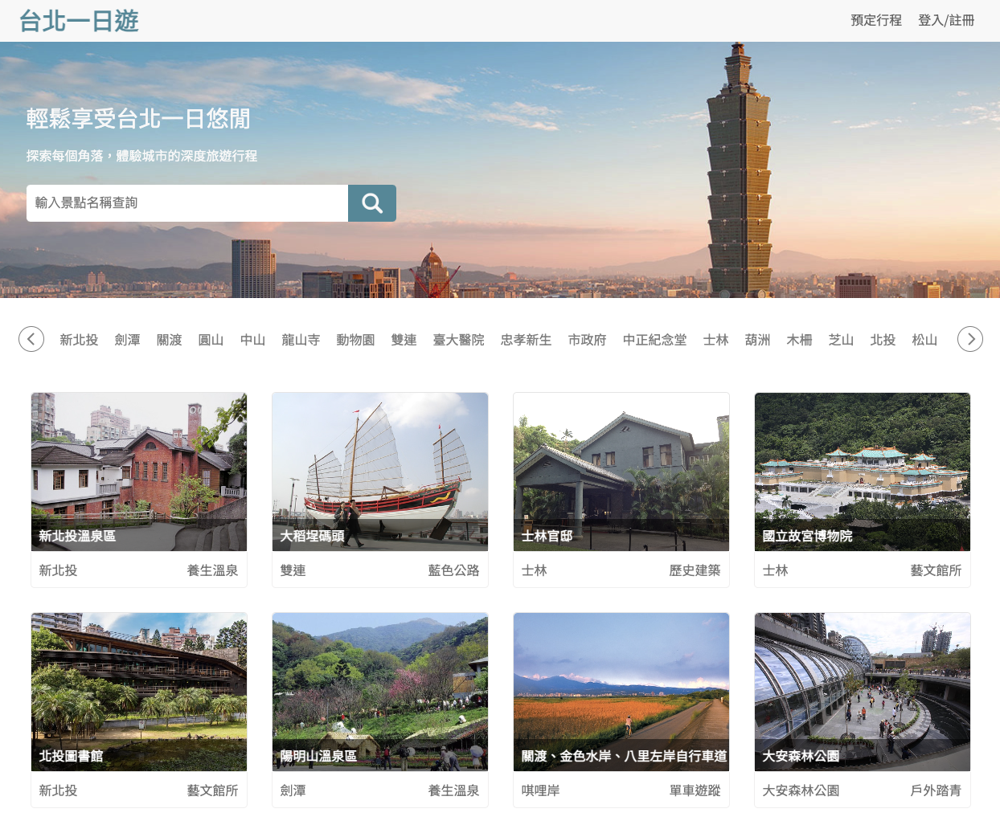
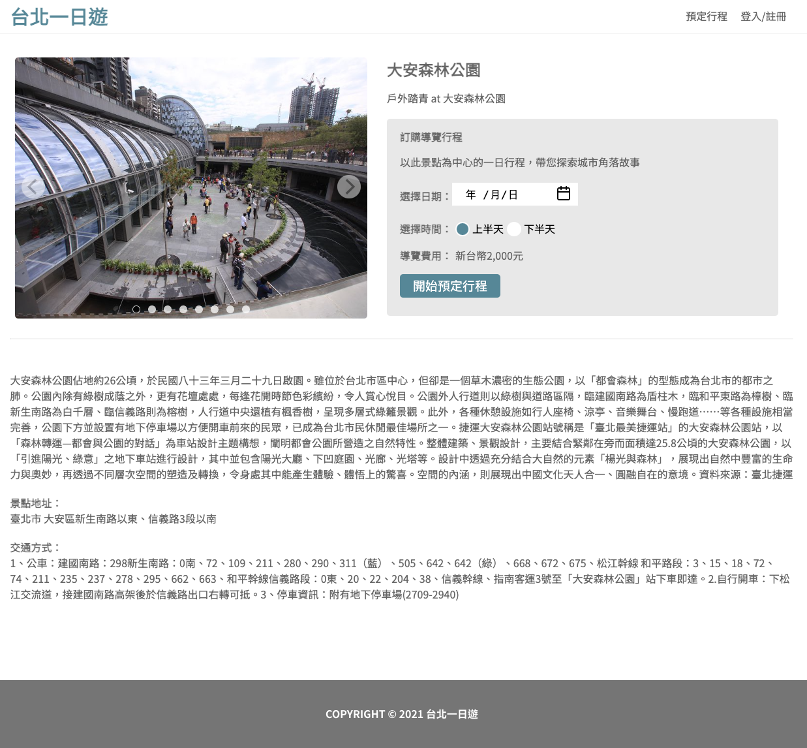
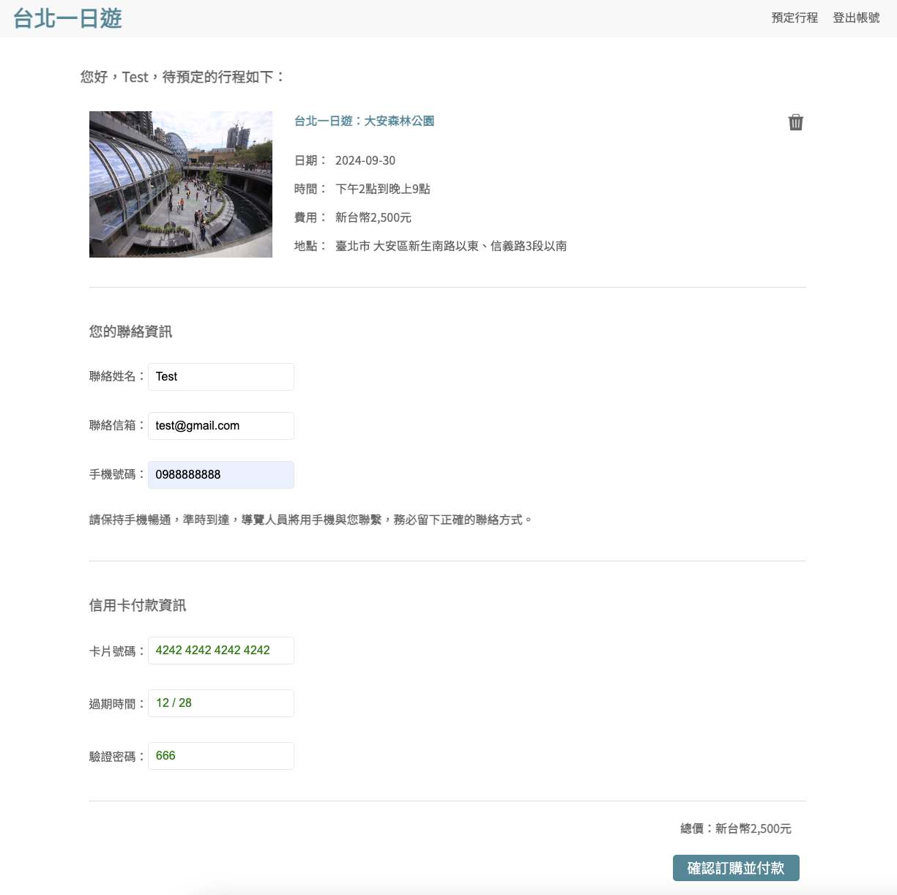
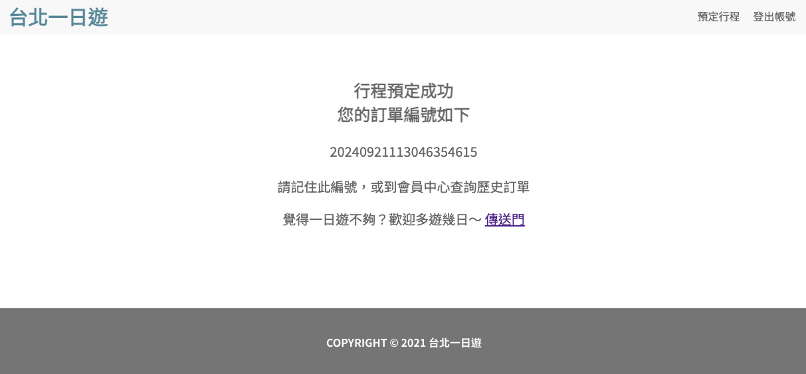

# Overview

It's an e-commerce tourism website focusing on taipei attractions from Taipei City Government.

Use the following techniques:
1. HTML/CSS/JavaScript
2. Python FastAPI
3. Python pytest
4. Docker
5. AWS - EC2, RDS, Route53
6. Nginx

Website: https://aliceta.cloud/taipei-trip/

Tesing account:
- email: test@gmail.com 
- password: testTEST8~

# Technical Flow

# Table Schema ERD

# Home Page

# Attraction Page

# Booking Page

# Order Page

